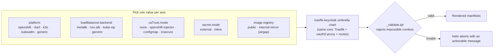

# Multi-distribution portability

This repo started as an OpenShift-only deployment. It is now portable across
on-prem / airgapped Kubernetes distributions through the **`traefik-keycloak`
umbrella Helm chart** and a set of **feature-flag presets**.

Supported out of the box: **OpenShift**, **Rancher RKE2**, **k3s**, **vanilla
kubeadm**, and **VMware Tanzu / TKG** (both NSX ALB and kube-vip). Any other
CNCF-conformant cluster works via the `generic`/`kubeadm` profile.

## How the combinations work (orthogonal axes)

There is **one core** (Traefik + oauth2-proxy + the dashboard routes, identical
everywhere). Portability comes from a few **independent axes** you pick from; the
chart renders the same core and `_validate.tpl` rejects the combinations that
cannot work. This is why there is no per-platform variant of the chart — you
compose one, you don't fork.

<details>
<summary><b>Diagram — orthogonal axes compose one core</b> (click to expand)</summary>



</details>

The axes are genuinely independent — e.g. OpenShift can use MetalLB *or* another
LB, and Tanzu can use NSX ALB *or* kube-vip. The matrices below inventory the
combinations that matter; the full Cartesian product is intentionally not
enumerated (it would be hundreds of rows describing the same core).

### Platform × LoadBalancer backend

What is typical, merely possible, or best avoided per platform:

| Platform ↓ / LB → | `metallb` | `nsx-alb` | `kube-vip` | `generic` |
|---|---|---|---|---|
| **openshift** | ✅ typical (MetalLB Operator) | ⚪ if Avi/AKO present | ⚪ possible | ⚪ external/physical LB |
| **rke2** | ✅ typical | ⚪ possible | ⚪ possible | ⚪ possible |
| **k3s** | ✅ typical | ⚪ possible | ⚪ possible | ⚪ built-in ServiceLB (klipper) |
| **kubeadm / generic** | ✅ typical | ⚪ possible | ⚪ possible | ⚪ possible |
| **Tanzu / TKG (vSphere)** | ⚠️ L2 often blocked by vSphere port-group security — use BGP | ✅ typical (NSX ALB + AKO) | ✅ typical (bare-metal/edge) | ⚪ possible |

✅ typical · ⚪ possible (supported, just less common) · ⚠️ caveat — read the note.

> vSphere caveat applies to **any** L2 mode (MetalLB L2, kube-vip ARP) regardless
> of platform: the port group must allow *Forged Transmits*, or the VIP is assigned
> but no traffic arrives. MetalLB **BGP** mode sidesteps it.

### Preset summary

Each `sites/values-<platform>.yaml` is a small delta over the chart defaults:

| Preset | `platform` | LB backend | Traefik pod UID | `caTrust.mode` | Cluster prerequisite |
|---|---|---|---|---|---|
| `values-openshift` | `openshift` | `metallb` | **null** (SCC injects a UID) | `openshift-injector` | MetalLB Operator + pool |
| `values-rke2` | `rke2` | `metallb` | `65532` | `none` | Disable bundled ingress-nginx; MetalLB |
| `values-k3s` | `k3s` | `metallb` | `65532` | `none` | Install k3s `--disable traefik`; MetalLB |
| `values-kubeadm` | `kubeadm` | `metallb` | `65532` | `none` | PodSecurity `restricted`; MetalLB |
| `values-tanzu-nsx` | `generic` | `nsx-alb` | `65532` | `none` | NSX ALB (Avi) + AKO |
| `values-tanzu-kubevip` | `generic` | `kube-vip` | `65532` | `none` | kube-vip in service mode |

### Keycloak certificate trust (`caTrust.mode`)

| Mode | Use when | Requires |
|---|---|---|
| `none` | Keycloak presents a public / enterprise-trusted cert | — |
| `openshift-injector` | OpenShift, trust the cluster CA bundle automatically | `platform=openshift` (validated) |
| `configmap` | Any distro, self-signed / private CA | `caTrust.bundle` (PEM) **or** a pre-created ConfigMap |
| `insecure` | Testing only — skips TLS verification | — (never in production) |

### Other axes

- **`secret.mode`** — `external` (default; you create the Secret out-of-band,
  GitOps-friendly via Sealed/External Secrets) or `inline` (chart renders it from
  values; dev only).
- **`image.registry`** — empty for public registries, or an internal mirror host
  for **airgap** (applies to oauth2-proxy; set `traefik.image.registry` for the
  Traefik image). See the chart README.

## Use this (current, portable)

- Chart: [`helm/traefik-keycloak/`](helm/traefik-keycloak/README.md) — start here.
- Presets: [`sites/values-<platform>.yaml`](sites/) — pick one.
- Imperative: `./install.sh <platform> [helm args...]`
- GitOps: [`argocd/apps/traefik-keycloak.yaml`](argocd/apps/traefik-keycloak.yaml)
  (single Application, vendored chart, airgap-ready).

```bash
helm install traefik ./helm/traefik-keycloak -f sites/values-rke2.yaml \
  --set dashboard.host=traefik.apps.mycluster.com \
  --set dashboard.cookieDomain=.apps.mycluster.com \
  --set keycloak.issuerUrl=https://keycloak.apps.mycluster.com/realms/myrealm
```

The chart README documents every feature flag, the fail-fast validation of
impossible combinations, and the airgap story (vendored Traefik chart + registry
prefixes). Read it before deploying.

## What changed, and why

Two problems in the original OpenShift-only layout were fixed on the way:

1. **`helm/values-traefik.yaml` did not validate against the pinned chart
   (41.0.2).** It used pre-existing keys (`logs.*`, `ports.web.redirectTo`,
   `ports.websecure.tls`) that the chart renamed (`log`/`accessLog`,
   `ports.web.http.redirections`, `ports.websecure.http.tls`). The umbrella
   chart carries the corrected values.
2. **The README claimed the Traefik pod UID was left unset, but it was not.**
   Chart 41.0.2 defaults `runAsUser: 65532`, and Helm's deep-merge kept it — which
   OpenShift's restricted-v2 SCC rejects. The chart now deletes it via an explicit
   null and each non-OpenShift preset sets a valid non-root UID.

## Removed in the migration

The original OpenShift-only pieces were removed once the umbrella chart replaced
them (they double-deployed the same resources and one no longer validated):

- `helm/values-traefik.yaml` → `helm/traefik-keycloak/values.yaml`.
- `manifests/` (raw oauth2-proxy + middlewares + routes) → the chart's `templates/`.
- `argocd/apps/traefik.yaml`, `argocd/apps/traefik-dashboard.yaml`,
  `argocd/root-app.yaml` (app-of-apps) → the single
  `argocd/apps/traefik-keycloak.yaml`.

The Keycloak setup (`keycloak/`), TLS guidance (`docs/tls-secret.md`), secret
templates (`secrets/`) and the MetalLB example (`metallb/`) are unchanged and
still apply.
