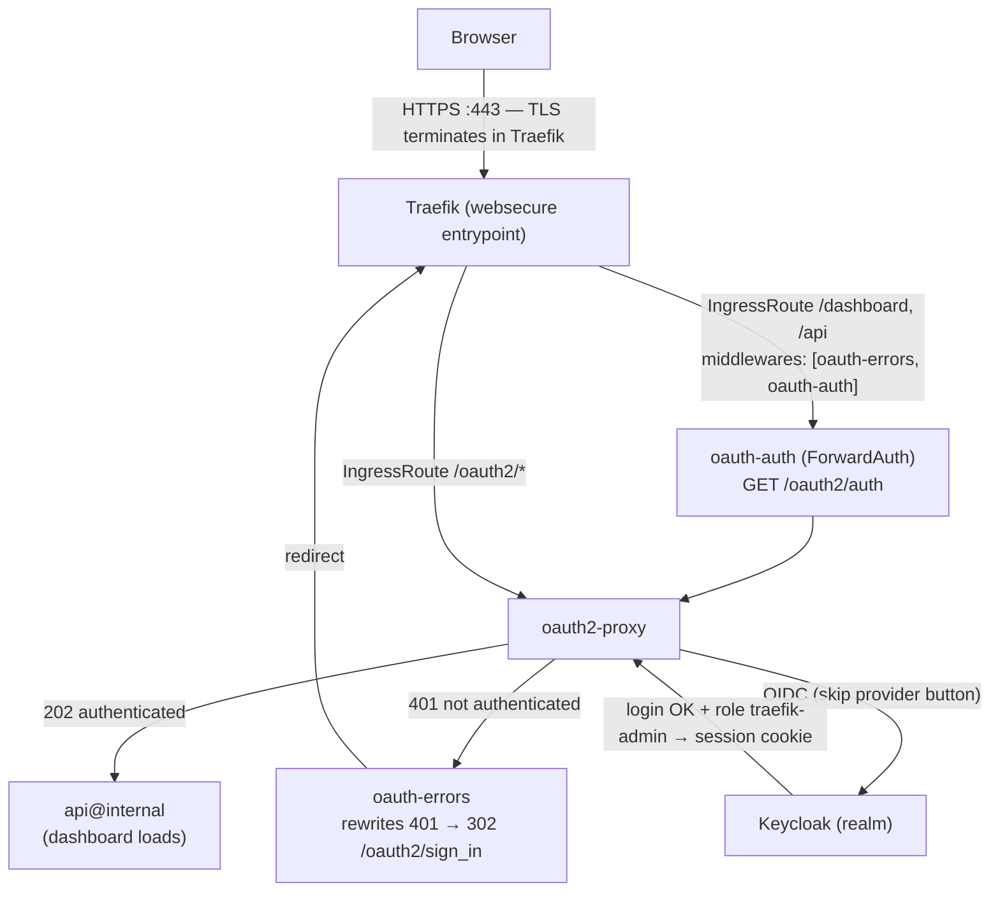

# Traefik + Keycloak-protected dashboard — portable across Kubernetes distros

<!-- Repository / meta badges -->
<p align="center">
  <a href="https://github.com/nubenetes/traefik-keycloak-portable/actions/workflows/ci.yml"></a>
  <a href="LICENSE"></a>
  
  
  <a href="https://github.com/nubenetes/traefik-keycloak-portable/issues"></a>
  <a href="https://github.com/nubenetes/traefik-keycloak-portable/stargazers"></a>
  
  
  
</p>

<!-- Tech-stack badges -->
<p align="center">
  
  
  
  
  
  
  
  
  
</p>

Deploys the **official Traefik chart** exposed via a **LoadBalancer**, with the
Traefik **dashboard authenticated against Keycloak** (oauth2-proxy + ForwardAuth)
and **restricted by role** (`traefik-admin`). Portable across on-prem / airgapped
distributions — **OpenShift, Rancher RKE2, k3s, kubeadm, VMware Tanzu/TKG** — via
a feature-flag umbrella Helm chart.

- **Start here:** [`PORTABILITY.md`](PORTABILITY.md) and the chart README
  [`helm/traefik-keycloak/README.md`](helm/traefik-keycloak/README.md).
- **GitOps:** [`argocd/README.md`](argocd/README.md).

## Architecture

The authentication flow is the **same on every platform** — only the load
balancer and pod-security profile differ (see [`PORTABILITY.md`](PORTABILITY.md)).

<details>
<summary><b>Diagram — authentication flow</b> (click to expand)</summary>



</details>

Why each piece:

- **Traefik OSS has no native OIDC.** `oauth2-proxy` performs the OIDC exchange
  with Keycloak; Traefik only asks "is this request authenticated?" through the
  `ForwardAuth` middleware against `/oauth2/auth`.
- The **`errors` middleware with `statusRewrites: "401": 302`** turns the 401
  into a real redirect to Keycloak. **Requires Traefik ≥ v3.4.** Without it you
  would see a blank 401 instead of the login page.
- **Role gate:** `OAUTH2_PROXY_ALLOWED_ROLES=traefik-dashboard:traefik-admin`
  only lets users with that role through.

## Quickstart

```bash
# 1) Pick a platform preset and fill in the 3 real values:
helm install traefik ./helm/traefik-keycloak -f sites/values-rke2.yaml \
  --set dashboard.host=traefik.apps.mycluster.com \
  --set dashboard.cookieDomain=.apps.mycluster.com \
  --set keycloak.issuerUrl=https://keycloak.apps.mycluster.com/realms/myrealm

# ...or imperatively with the wrapper script:
./install.sh rke2 --set dashboard.host=... --set keycloak.issuerUrl=...
```

Platforms: `openshift`, `rke2`, `k3s`, `kubeadm`, `tanzu-nsx`, `tanzu-kubevip`.
Every feature flag is documented in
[`helm/traefik-keycloak/values.yaml`](helm/traefik-keycloak/values.yaml); the chart
validates impossible combinations and aborts with a clear message.

## Repository layout

```
helm/traefik-keycloak/     Umbrella chart (Traefik vendored + oauth2-proxy/dashboard)
  values.yaml              Full catalogue of feature flags (documented)
  charts/traefik-*.tgz     Vendored official Traefik chart (airgap)
  templates/               oauth2-proxy, middlewares, routes, CA trust, validation
sites/values-<platform>.yaml   Per-platform presets (the delta)
argocd/                    GitOps: AppProject + single Application
install.sh <platform>      Imperative install (kubectl)
secrets/                   oauth2-proxy Secret template (out-of-band)
docs/tls-secret.md         How to create the traefik-dashboard-tls Secret
keycloak/                  How to create the Keycloak client + role
metallb/                   Optional MetalLB IPAddressPool example
PORTABILITY.md             Portability overview and what changed
```

## Prerequisites

| Requirement | Check |
|---|---|
| Target cluster + kubectl/oc session | `kubectl get nodes` |
| Helm v3 CLI | `helm version` |
| A LoadBalancer provider with an address pool | see below |
| Keycloak reachable over HTTPS | open its console |
| Permissions to create namespace + CRDs | cluster-admin or equivalent |
| Manageable DNS for the dashboard host | points to the LoadBalancer IP |

LoadBalancer per platform: MetalLB (RKE2/k3s/kubeadm/OpenShift-on-bare-metal or
vSphere), NSX ALB / kube-vip (Tanzu). On vSphere, L2 modes need the port group to
allow *Forged Transmits*; see `sites/values-openshift.yaml` for the full note.

## Configuration you still do out-of-band

1. **TLS Secret** `traefik-dashboard-tls` (Traefik terminates TLS) — see
   `docs/tls-secret.md`.
2. **oauth2-proxy Secret** (client + cookie secret) — copy
   `secrets/oauth2-proxy-secret.example.yaml`, fill it, apply it. Or set
   `secret.mode=inline` in the chart (dev only).
3. **Keycloak client** `traefik-dashboard` (confidential, standard flow) with a
   valid redirect URI `https://<dashboard.host>/oauth2/callback`, and a client
   role `traefik-admin` assigned to allowed users — see
   `keycloak/keycloak-client-setup.md`.
4. **DNS** A record for `<dashboard.host>` → the LoadBalancer external IP.

## Troubleshooting

| Symptom | Likely cause | Fix |
|---|---|---|
| Blank 401 (no redirect) | Traefik < v3.4, or missing `oauth-errors` / wrong middleware order | Use Traefik ≥ v3.4; order `[oauth-errors, oauth-auth]` |
| 403 after login | User lacks the `traefik-admin` role | Assign the role in Keycloak |
| Redirect loop | `cookieDomain` does not cover the host | Set `dashboard.cookieDomain` to the shared parent domain |
| Invalid `redirect_uri` | Keycloak Valid redirect URI mismatch | Must be `https://<dashboard.host>/oauth2/callback` |
| `x509: unknown authority` | oauth2-proxy does not trust the Keycloak cert | Set `caTrust.mode` (openshift-injector / configmap), or `insecure` for tests |
| `invalid issuer` | issuer with/without `/auth` wrong | Check `<issuer>/.well-known/openid-configuration` |
| Service has no EXTERNAL-IP | No LB provider / pool, or blocked L2 on vSphere | Install MetalLB/NSX ALB/kube-vip; allow Forged Transmits, or use BGP |
| Traefik pod `CreateContainerConfigError` (OpenShift) | A pinned UID conflicts with the SCC | Use `platform=openshift` (leaves UID unset); the chart validates this |

Operate the dashboard: open `https://<dashboard.host>/dashboard/` → redirect to
Keycloak → log in with a `traefik-admin` user → back to the dashboard.
