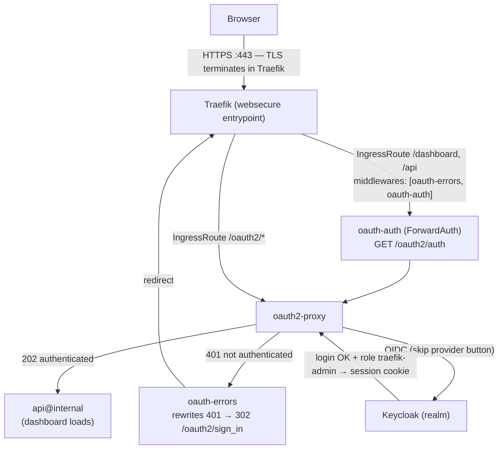
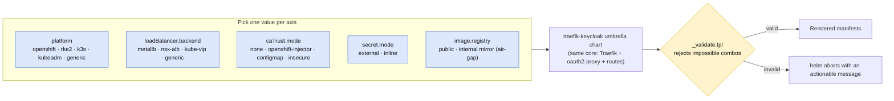
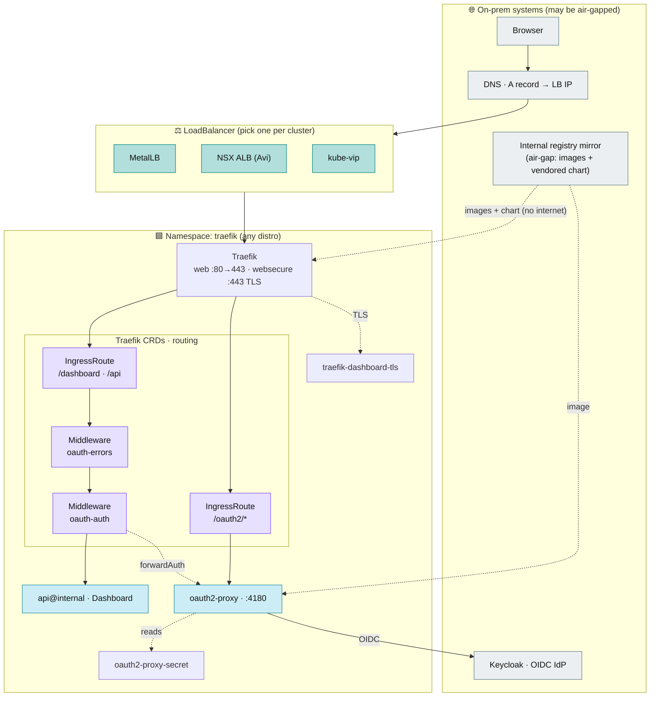
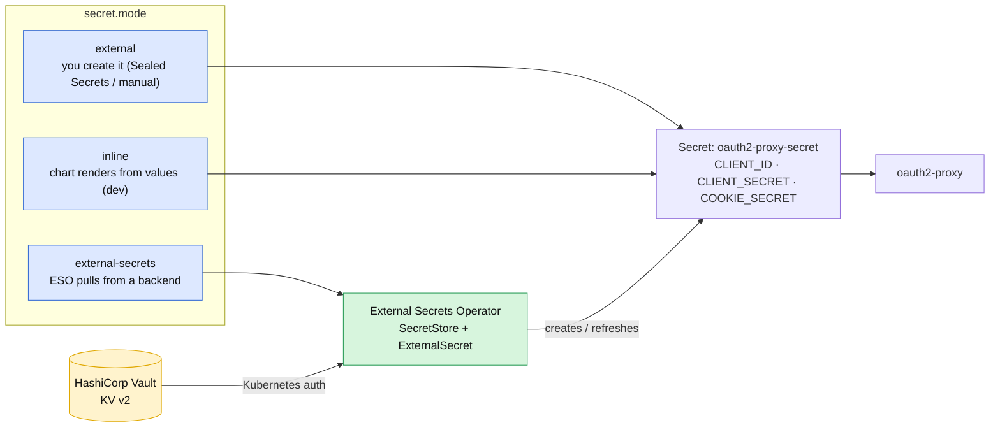
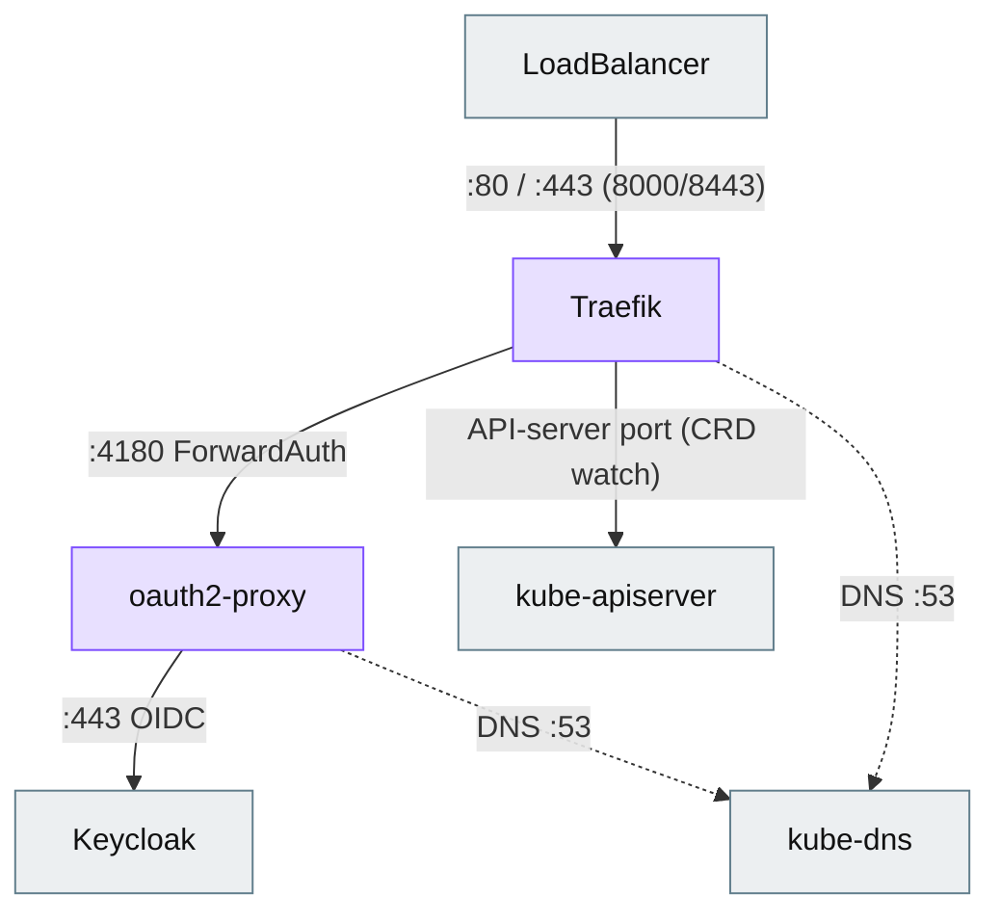
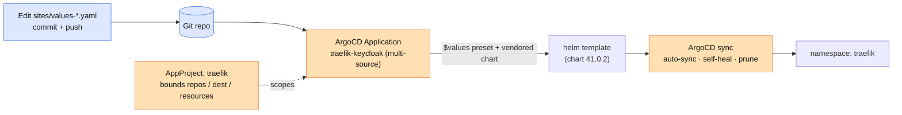

# Traefik + Keycloak-protected dashboard — portable across Kubernetes distros

<!-- Repository / meta badges -->
<p align="center">
  <a href="https://github.com/nubenetes/traefik-keycloak-portable/actions/workflows/ci.yml"></a>
  <a href="LICENSE"></a>
  
  
  <a href="https://github.com/nubenetes/traefik-keycloak-portable/issues"></a>
  <a href="https://github.com/nubenetes/traefik-keycloak-portable/stargazers"></a>
  
  
  
</p>

<!-- Tech-stack badges -->
<p align="center">
  
  
  
  
  
  
  
  
  
</p>

A single **umbrella Helm chart** that deploys the **official Traefik chart**
(vendored) behind a **LoadBalancer**, with the Traefik **dashboard authenticated
against Keycloak** (oauth2-proxy + ForwardAuth) and **restricted by role**
(`traefik-admin`). It is **portable across on-prem / air-gapped Kubernetes
distributions** — **OpenShift, Rancher RKE2, k3s, kubeadm, VMware Tanzu/TKG** —
driven by a small set of **feature flags**, with **fail-fast validation** that
rejects impossible combinations at `helm template` time instead of shipping a
broken deployment.

Rather than a per-distribution fork, one core composes along a few independent
axes:

- **Distribution** — `platform`: OpenShift (SCC-aware UID handling) · RKE2 · k3s ·
  kubeadm · generic. ([§2](#2-how-portability-works-orthogonal-axes), [§4](#4-supported-platforms--presets))
- **Load balancer** — `loadBalancer.backend`: **MetalLB · NSX ALB (Avi) ·
  kube-vip · Cilium** LB-IPAM · generic. ([§4](#4-supported-platforms--presets))
- **Secrets** — `secret.mode`: pre-created (Sealed Secrets) · inline (dev) ·
  **External Secrets Operator + HashiCorp Vault**. ([§10](#10-secrets-management))
- **Keycloak TLS trust** — `caTrust.mode`: none · OpenShift CA injector ·
  custom CA ConfigMap · insecure (test). ([§9](#9-feature-flag-reference))
- **Network** — optional **NetworkPolicies** for default-deny CNIs (Calico /
  Cilium); storage (**CSI**) is not applicable — the workload is stateless.
  ([§11](#11-cni--csi))
- **Air-gap** — vendored Traefik chart (no `traefik.github.io` pull) + internal
  registry-mirror overrides for every image. ([§12](#12-air-gapped--disconnected))
- **Delivery** — imperative (`install.sh`) or **GitOps** (single multi-source
  ArgoCD Application). ([§8](#8-step-by-step-install), [§16](#16-gitops-with-argocd))

> This is the multi-distribution sibling of
> [`traefik-keycloak-openshift-gitops`](https://github.com/nubenetes/traefik-keycloak-openshift-gitops)
> (OpenShift-only). If you deploy on OpenShift *exclusively*, either works; this
> repo generalises the same design to any distribution.

## Table of contents

1. [Architecture](#1-architecture)
2. [How portability works (orthogonal axes)](#2-how-portability-works-orthogonal-axes)
3. [Deployment topology](#3-deployment-topology)
4. [Supported platforms & presets](#4-supported-platforms--presets)
5. [Repository layout](#5-repository-layout)
6. [Prerequisites](#6-prerequisites)
7. [Configuration](#7-configuration)
8. [Step-by-step install](#8-step-by-step-install)
9. [Feature-flag reference](#9-feature-flag-reference)
10. [Secrets management](#10-secrets-management)
11. [CNI & CSI](#11-cni--csi)
12. [Air-gapped / disconnected](#12-air-gapped--disconnected)
13. [Upgrade](#13-upgrade)
14. [Decommission](#14-decommission)
15. [Operations & troubleshooting](#15-operations--troubleshooting)
16. [GitOps with ArgoCD](#16-gitops-with-argocd)
17. [Contributing & license](#17-contributing--license)

---

## 1. Architecture

The authentication flow is the **same on every platform** — only the load
balancer and the pod-security profile differ.

- **Traefik OSS has no native OIDC.** `oauth2-proxy` performs the OIDC exchange
  with Keycloak; Traefik only asks "is this request authenticated?" through the
  `ForwardAuth` middleware against `/oauth2/auth`.
- The **`errors` middleware with `statusRewrites: "401": 302`** turns the 401
  into a real redirect to Keycloak. **Requires Traefik ≥ v3.4.** Without it you
  would see a blank 401 instead of the login page.
- **Role gate:** `oauth2Proxy.allowedRoles=traefik-dashboard:traefik-admin` only
  lets users carrying that role through; everyone else gets 403 after login.

<details>
<summary><b>Diagram — authentication flow</b> (click to expand)</summary>



</details>

## 2. How portability works (orthogonal axes)

There is **one core** (Traefik + oauth2-proxy + the dashboard routes, identical
everywhere). Portability comes from a few **independent axes** you pick from; the
chart renders the same core and [`_validate.tpl`](helm/traefik-keycloak/templates/_validate.tpl)
rejects the combinations that cannot work. This is why there is **no per-platform
fork** of the chart — you compose one, you don't copy it.

<details>
<summary><b>Diagram — orthogonal axes compose one core</b> (click to expand)</summary>



</details>

The axes are genuinely independent — e.g. OpenShift can use MetalLB *or* another
LB, and Tanzu can use NSX ALB *or* kube-vip. See §4 for the combinations that
matter; the full Cartesian product is intentionally not enumerated (hundreds of
rows describing the same core).

## 3. Deployment topology

<details>
<summary><b>Diagram — deployment topology (any distribution)</b> (click to expand)</summary>



</details>

## 4. Supported platforms & presets

### Platform × LoadBalancer backend

What is typical, merely possible, or best avoided per platform:

| Platform ↓ / LB → | `metallb` | `nsx-alb` | `kube-vip` | `cilium` | `generic` |
|---|---|---|---|---|---|
| **openshift** | ✅ typical (MetalLB Operator) | ⚪ if Avi/AKO present | ⚪ possible | ⚪ if Cilium CNI | ⚪ external/physical LB |
| **rke2** | ✅ typical | ⚪ possible | ⚪ possible | ⚪ if Cilium CNI | ⚪ possible |
| **k3s** | ✅ typical | ⚪ possible | ⚪ possible | ⚪ if Cilium CNI | ⚪ built-in ServiceLB (klipper) |
| **kubeadm / generic** | ✅ typical | ⚪ possible | ⚪ possible | ⚪ if Cilium CNI | ⚪ possible |
| **Tanzu / TKG (vSphere)** | ⚠️ L2 often blocked by vSphere port-group security — use BGP | ✅ typical (NSX ALB + AKO) | ✅ typical (bare-metal/edge) | ⚪ if Cilium CNI | ⚪ possible |

✅ typical · ⚪ possible (supported, less common) · ⚠️ caveat.

`cilium` fits when Cilium is already the CNI and does the LoadBalancer (LB-IPAM /
L2 announcements / BGP), so no MetalLB is needed — request an IP with the
`lbipam.cilium.io/ips` annotation on the Service.

> **vSphere caveat** applies to **any** L2 mode (MetalLB L2, kube-vip ARP)
> regardless of platform — including OpenShift-on-vSphere: the port group must
> allow *Forged Transmits*, or the VIP is assigned but no traffic arrives.
> MetalLB **BGP** mode sidesteps it. This is separate from the cluster's own
> API/Ingress VIP (keepalived on IPI), which serves the cluster, not this Service.

### Preset summary

Each `sites/values-<platform>.yaml` is a small delta over the chart defaults:

| Preset | `platform` | LB backend | Traefik pod UID | `caTrust.mode` | Cluster prerequisite |
|---|---|---|---|---|---|
| `values-openshift` | `openshift` | `metallb` | **null** (SCC injects a UID) | `openshift-injector` | MetalLB Operator + pool |
| `values-rke2` | `rke2` | `metallb` | `65532` | `none` | Disable bundled ingress-nginx; MetalLB |
| `values-k3s` | `k3s` | `metallb` | `65532` | `none` | Install k3s `--disable traefik`; MetalLB |
| `values-kubeadm` | `kubeadm` | `metallb` | `65532` | `none` | PodSecurity `restricted`; MetalLB |
| `values-tanzu-nsx` | `generic` | `nsx-alb` | `65532` | `none` | NSX ALB (Avi) + AKO |
| `values-tanzu-kubevip` | `generic` | `kube-vip` | `65532` | `none` | kube-vip in service mode |

### Why the pod UID differs

OpenShift's `restricted-v2` SCC **injects** a UID from the namespace range, so the
Traefik pod UID must be left **null** (pinning one is rejected). Every other
distribution has no such injector, so the preset sets an explicit non-root UID
(`65532`). The chart deletes the Traefik chart's built-in `65532` with an explicit
null and the non-OpenShift presets add it back — see the note in
[`values.yaml`](helm/traefik-keycloak/values.yaml). Consequence: **install with a
preset**; a bare `helm install` with no preset fails validation on purpose.

## 5. Repository layout

```
helm/traefik-keycloak/          Umbrella chart
  Chart.yaml                    Depends on the vendored Traefik chart
  values.yaml                   Full catalogue of feature flags (documented)
  charts/traefik-41.0.2.tgz     Vendored official Traefik chart (air-gap)
  templates/
    oauth2-proxy-deployment.yaml  oauth2-proxy (keycloak-oidc provider)
    oauth2-proxy-service.yaml
    middlewares.yaml              oauth-auth (ForwardAuth) + oauth-errors
    ingressroutes.yaml            /oauth2/* and /dashboard routes
    trusted-ca-configmap.yaml     CA trust (openshift-injector / configmap)
    oauth2-proxy-secret.yaml      rendered only when secret.mode=inline
    external-secrets.yaml         ESO SecretStore + ExternalSecret (secret.mode=external-secrets)
    networkpolicy.yaml            NetworkPolicies (networkPolicy.enabled)
    validation.yaml + _validate.tpl   fail-fast combo validation
    _helpers.tpl
  README.md                     Chart-level reference (every flag)
sites/values-<platform>.yaml    Per-platform presets (the delta)
argocd/                         GitOps: AppProject + single Application
  apps/traefik-keycloak.yaml    multi-source (vendored chart + $values preset)
  project.yaml
  README.md
docs/                           tls-secret.md, air-gapped.md,
                                external-secrets.md, network-policies.md
keycloak/keycloak-client-setup.md
metallb/ipaddresspool.example.yaml
secrets/oauth2-proxy-secret.example.yaml
scripts/validate-mermaid.mjs    CI: parse every mermaid diagram
install.sh <platform>           Imperative install (kubectl)
PORTABILITY.md                  Migration notes / what changed vs OpenShift-only
```

## 6. Prerequisites

| Requirement | Check |
|---|---|
| Target cluster + kubectl/oc session | `kubectl get nodes` |
| Helm v3 CLI | `helm version` |
| A LoadBalancer provider with an address pool | MetalLB / NSX ALB / kube-vip |
| Keycloak reachable over HTTPS | open its console |
| Permissions to create namespace + CRDs | cluster-admin or equivalent |
| Manageable DNS for the dashboard host | points to the LoadBalancer IP |

Platform-specific prerequisites (bundled-component conflicts, etc.) are listed at
the top of each `sites/values-<platform>.yaml`.

## 7. Configuration

Set the handful of real values — inline with `--set`, or by editing a copy of the
preset:

| Value | What it is | Example |
|---|---|---|
| `dashboard.host` | Public FQDN of the dashboard | `traefik.apps.mycluster.com` |
| `dashboard.cookieDomain` | Parent domain shared by dashboard + Keycloak | `.apps.mycluster.com` |
| `dashboard.tlsSecretName` | Pre-created TLS Secret (Traefik terminates TLS) | `traefik-dashboard-tls` |
| `keycloak.issuerUrl` | OIDC issuer (Keycloak 17+: `/realms/<realm>`) | `https://keycloak…/realms/myrealm` |
| `oauth2Proxy.allowedRoles` | Role gate (`client:role` or `realm-role`) | `traefik-dashboard:traefik-admin` |

Out-of-band (see the linked docs):
- **TLS Secret** — [`docs/tls-secret.md`](docs/tls-secret.md).
- **oauth2-proxy Secret** — [`secrets/`](secrets/) (or `secret.mode=inline` for dev).
- **Keycloak client + `traefik-admin` role** — [`keycloak/keycloak-client-setup.md`](keycloak/keycloak-client-setup.md).
- **DNS** A record for `dashboard.host` → LoadBalancer IP.

## 8. Step-by-step install

Pick **one** path.

### 8.A — Imperative (Helm / kubectl)

```bash
# 1) Create the namespace + PodSecurity label, then install with your preset:
./install.sh rke2 \
  --set dashboard.host=traefik.apps.mycluster.com \
  --set dashboard.cookieDomain=.apps.mycluster.com \
  --set keycloak.issuerUrl=https://keycloak.apps.mycluster.com/realms/myrealm

# (install.sh wraps: namespace + PSA label, then `helm upgrade --install` with
#  sites/values-<platform>.yaml. The Traefik chart is vendored — no internet pull.)

# 2) Read the LoadBalancer IP and create the DNS A record:
kubectl get svc -n traefik -l app.kubernetes.io/name=traefik -o wide
```

Platforms: `openshift`, `rke2`, `k3s`, `kubeadm`, `tanzu-nsx`, `tanzu-kubevip`.

### 8.B — GitOps with ArgoCD (recommended)

See [`argocd/README.md`](argocd/README.md). In short: pick your preset in
`argocd/apps/traefik-keycloak.yaml`, then:

```bash
kubectl apply -n openshift-gitops -f argocd/project.yaml          # or -n argocd
kubectl apply -n openshift-gitops -f argocd/apps/traefik-keycloak.yaml
```

Secrets are created out-of-band first (§7) — ArgoCD does not manage them unless
you use Sealed/External Secrets or `secret.mode=inline`.

## 9. Feature-flag reference

Every flag lives in [`helm/traefik-keycloak/values.yaml`](helm/traefik-keycloak/values.yaml)
(fully commented). Summary:

| Flag | Values | What it does |
|---|---|---|
| `platform` | `generic` `openshift` `rke2` `k3s` `kubeadm` | Distribution profile; drives pod-security expectations. Validated. |
| `loadBalancer.backend` | `metallb` `nsx-alb` `kube-vip` `cilium` `generic` | Documents/validates the LB. Annotations go in `traefik.service.annotations`. |
| `image.registry` | `""` or host | Air-gap registry prefix for the oauth2-proxy image (`traefik.image.registry` for Traefik). |
| `caTrust.mode` | `none` `openshift-injector` `configmap` `insecure` | How oauth2-proxy trusts the Keycloak TLS cert. |
| `secret.mode` | `external` `inline` `external-secrets` | Reference a pre-created Secret (default), render one from values (dev), or pull it from a backend via ESO ([§10](#10-secrets-management)). |
| `networkPolicy.enabled` | `false` `true` | Render minimal NetworkPolicies for default-deny clusters ([§11](#11-cni--csi)). |
| `dashboard.*` `keycloak.*` `oauth2Proxy.*` | — | Hostnames, OIDC issuer, role gate, replicas, resources. |

### Fail-fast validation

`helm install`/`helm template` runs the validation first and aborts on an
impossible combination:

- Enum checks on `platform`, `loadBalancer.backend`, `caTrust.mode`, `secret.mode`.
- `caTrust.mode=openshift-injector` ⇒ requires `platform=openshift`.
- `platform=openshift` ⇒ `runAsUser` must be null; `platform≠openshift` ⇒ a
  non-root `runAsUser` must be set.
- `secret.mode=inline` ⇒ `clientSecret` and `cookieSecret` must be set.
- `secret.mode=external-secrets` ⇒ a `SecretStore` ref (and, when the chart
  creates the store, a Vault `server`) must be set.
- `dashboard.host` and `keycloak.issuerUrl` must be non-empty.

## 10. Secrets management

oauth2-proxy needs three values — `OAUTH2_PROXY_CLIENT_ID`, `_CLIENT_SECRET`,
`_COOKIE_SECRET` — in a Secret named by `secret.name`. How that Secret comes to
exist is the `secret.mode` axis:

| `secret.mode` | Who creates the Secret | Use when |
|---|---|---|
| `external` (default) | You, out-of-band (manually, or **Sealed Secrets**) | GitOps and you seal secrets, or you apply them by hand |
| `inline` | The chart, from `secret.clientSecret` / `secret.cookieSecret` | Dev / demo only — keep the values out of public git |
| `external-secrets` | The **External Secrets Operator**, pulled from a backend (e.g. **HashiCorp Vault**) | GitOps with a real secrets backend — nothing sensitive in git |

`external-secrets` mode renders a `SecretStore` (→ Vault, Kubernetes auth) and an
`ExternalSecret` that fills `oauth2-proxy-secret`; the oauth2-proxy Deployment
consumes it unchanged. Full setup (Vault KV, policy, role, self-signed CA) is in
**[`docs/external-secrets.md`](docs/external-secrets.md)**.

<details>
<summary><b>Diagram — secret modes and the ESO/Vault flow</b> (click to expand)</summary>



</details>

## 11. CNI & CSI

Two questions come up for on-prem clusters: does the **CNI** (Calico, Cilium,
OVN-Kubernetes, Antrea, flannel…) or the **CSI** (storage) choice affect this
deployment? Short answer: **CSI not at all; CNI only through NetworkPolicy**.

### CSI / storage — not applicable

The workload is **stateless**: no PersistentVolumeClaims, no `StorageClass`
dependency. Traefik runs with `readOnlyRootFilesystem` and an `emptyDir`; TLS
comes from a pre-created Secret (no ACME/`acme.json` to persist); oauth2-proxy
sessions are cookie-based. So the CSI driver and storage classes are irrelevant
here. (Storage only re-enters if you self-host Keycloak or Vault in-cluster —
those are external dependencies, out of scope for this chart.)

### CNI — the workload is agnostic, except NetworkPolicy

Pods are standard and run on any CNI. The one place the CNI matters is
**NetworkPolicy enforcement**: on a **default-deny** cluster (common with Calico
or Cilium in secure / air-gapped environments) the required flows would be
blocked — Traefik→oauth2-proxy (ForwardAuth), oauth2-proxy→Keycloak (OIDC), and
Traefik→API server (the `kubernetesCRD` provider watch). Set
`networkPolicy.enabled=true` to render a minimal, working policy set. Details and
tightening options in **[`docs/network-policies.md`](docs/network-policies.md)**.

> Cilium can also **be the load balancer** (LB-IPAM) — that is the
> `loadBalancer.backend=cilium` value (§4), a different axis from NetworkPolicy.

<details>
<summary><b>Diagram — allowed flows with networkPolicy.enabled</b> (click to expand)</summary>



</details>

## 12. Air-gapped / disconnected

Two things must resolve without internet; both are handled — details in
[`docs/air-gapped.md`](docs/air-gapped.md):

1. **The Traefik chart is vendored** in `charts/traefik-41.0.2.tgz`, so neither
   `helm install` nor an ArgoCD sync pulls from `traefik.github.io`.
2. **Image registries are parameterised.** Point them at your internal mirror:
   ```bash
   --set image.registry=harbor.internal.example.com \
   --set traefik.image.registry=harbor.internal.example.com
   ```
   Mirror `oauth2-proxy` and `traefik` into that registry beforehand.

## 13. Upgrade

```bash
# Bump the vendored Traefik chart:
helm pull traefik/traefik --version <X.Y.Z> -d helm/traefik-keycloak/charts/
# update dependencies.version in helm/traefik-keycloak/Chart.yaml, remove the old .tgz

# Re-render/lint before shipping:
helm lint ./helm/traefik-keycloak -f sites/values-<platform>.yaml
helm template t ./helm/traefik-keycloak -f sites/values-<platform>.yaml >/dev/null

# Imperative apply:
helm upgrade traefik ./helm/traefik-keycloak -n traefik -f sites/values-<platform>.yaml
```

Keep Traefik **≥ v3.4** (the `errors` middleware `statusRewrites` requirement).
Under GitOps, commit the change and let ArgoCD reconcile — do not `helm`/`kubectl`
by hand.

## 14. Decommission

```bash
# Imperative:
helm uninstall traefik -n traefik
kubectl delete namespace traefik

# GitOps: delete the Application (finalizer cascades to its resources):
kubectl delete -n openshift-gitops application/traefik-keycloak
```

External cleanup: DNS record, Keycloak client + `traefik-admin` role, MetalLB pool
(if dedicated), and the Traefik CRDs if you want them gone
(`kubectl get crd | grep traefik.io`).

## 15. Operations & troubleshooting

```bash
kubectl get pods,svc -n traefik
kubectl logs -n traefik deploy/oauth2-proxy -f      # OIDC, issuer, CA, roles
kubectl logs -n traefik deploy/traefik | grep -i error
```

| Symptom | Likely cause | Fix |
|---|---|---|
| Blank 401 (no redirect) | Traefik < v3.4, or wrong middleware order | Traefik ≥ v3.4; order `[oauth-errors, oauth-auth]` |
| 403 after login | User lacks the `traefik-admin` role | Assign the role in Keycloak |
| Redirect loop | `dashboard.cookieDomain` doesn't cover the host | Set it to the shared parent domain |
| Invalid `redirect_uri` | Keycloak redirect URI mismatch | Must be `https://<dashboard.host>/oauth2/callback` |
| `x509: unknown authority` | oauth2-proxy doesn't trust the Keycloak cert | Set `caTrust.mode` (openshift-injector / configmap), or `insecure` for tests |
| `invalid issuer` | issuer with/without `/auth` wrong | Check `<issuer>/.well-known/openid-configuration` |
| Service has no EXTERNAL-IP | No LB provider/pool, or blocked L2 on vSphere | Install MetalLB/NSX ALB/kube-vip; allow Forged Transmits, or use BGP |
| Traefik pod `CreateContainerConfigError` (OpenShift) | A pinned UID conflicts with the SCC | Use `platform=openshift` (leaves UID unset) — the chart validates this |
| `helm` aborts: "requires an explicit non-root runAsUser" | Installed with no preset | Install with a `sites/` preset |
| Login times out / ForwardAuth 502 after enabling policies | `networkPolicy.enabled=true` but the cluster/CNI needs different ports (e.g. API server on 443) | Set `networkPolicy.apiServerPort`; check `keycloakEgressCIDR`; see [`docs/network-policies.md`](docs/network-policies.md) |
| `oauth2-proxy-secret` never appears (ESO) | Wrong Vault role/path, or ESO can't auth | Check the `ExternalSecret` status and ESO logs; verify the Vault role binds the SA + namespace ([`docs/external-secrets.md`](docs/external-secrets.md)) |

## 16. GitOps with ArgoCD

<details>
<summary><b>Diagram — GitOps reconciliation</b> (click to expand)</summary>



</details>

Design points (full detail in [`argocd/README.md`](argocd/README.md)):

- **Single Application**, multi-source: the vendored chart is fed the platform
  preset via the `$values` ref (a `-f` path outside the chart dir is rejected by
  ArgoCD, so the ref pattern is used).
- **Namespace** created and PSA-labelled via `managedNamespaceMetadata`.
- **`ServerSideApply=true`** avoids the *"metadata.annotations: Too long"* error
  on Traefik's large CRDs.
- **Dedicated AppProject** bounds repos (just this one — the chart is vendored),
  destination (`traefik` namespace) and cluster-scoped resources.
- **Secrets** stay out of git (Sealed/External Secrets), or use `secret.mode=inline`.

## 17. Contributing & license

CI (`.github/workflows/ci.yml`) runs `helm lint` + `helm template`/kubeconform for
every preset, the validation-rule checks, `yamllint`, `shellcheck`, and parses
every mermaid diagram (`scripts/validate-mermaid.mjs`). Please keep it green.

Licensed under the [MIT License](LICENSE).

> **Status:** untested on a live cluster — all validation is `helm lint` /
> `helm template` / kubeconform / mermaid parsing, not runtime.
