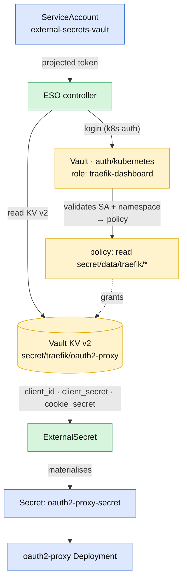

# Secrets from a backend (HashiCorp Vault) via the External Secrets Operator

The GitOps-friendly way to handle the oauth2-proxy credentials: **no secret
material in git**. You store the values in a backend (e.g. HashiCorp Vault); the
[External Secrets Operator](https://external-secrets.io/) (ESO) reads them and
materialises the `oauth2-proxy-secret` Secret in-cluster. Only the
`SecretStore`/`ExternalSecret` references live in git, and they carry no
sensitive data.

This is distribution-neutral — it works on OpenShift, RKE2, k3s, kubeadm and
Tanzu alike (the OpenShift-only sibling repo ships the same idea as raw
manifests; here it is a chart option).

## Enable it

Set `secret.mode=external-secrets` and point the chart at your backend:

```bash
helm upgrade --install traefik ./helm/traefik-keycloak -n traefik \
  -f sites/values-<platform>.yaml \
  --set secret.mode=external-secrets \
  --set secret.externalSecrets.vault.server=https://vault.corp.example.com:8200 \
  --set secret.externalSecrets.vault.auth.kubernetes.role=traefik-dashboard
```

The chart then renders (see [`templates/external-secrets.yaml`](../helm/traefik-keycloak/templates/external-secrets.yaml)):

- a **ServiceAccount** (`external-secrets-vault`) whose token ESO uses for
  Kubernetes auth (skip with `createServiceAccount=false`),
- a **SecretStore** → Vault (skip with `createStore=false` to reference an
  existing one),
- an **ExternalSecret** that fills `oauth2-proxy-secret` with
  `OAUTH2_PROXY_CLIENT_ID` / `_CLIENT_SECRET` / `_COOKIE_SECRET`.

The oauth2-proxy Deployment already consumes `oauth2-proxy-secret` by name — no
other change needed.

<details>
<summary><b>Diagram — ESO ↔ Vault Kubernetes-auth flow</b> (click to expand)</summary>



</details>

## Values

| Value | Meaning | Default |
|---|---|---|
| `secret.externalSecrets.apiVersion` | ESO API version (`external-secrets.io/v1`; older ESO: `v1beta1`) | `external-secrets.io/v1` |
| `secret.externalSecrets.refreshInterval` | How often ESO re-reads the backend | `1h` |
| `secret.externalSecrets.createServiceAccount` / `serviceAccountName` | Render the auth SA / its name | `true` / `external-secrets-vault` |
| `secret.externalSecrets.createStore` / `storeRef.{name,kind}` | Render a SecretStore / reference one | `true` / `vault-backend`, `SecretStore` |
| `secret.externalSecrets.vault.{server,path,version}` | Vault address, KV mount, KV version | — / `secret` / `v2` |
| `secret.externalSecrets.vault.auth.kubernetes.{mountPath,role}` | Vault Kubernetes-auth mount + role | `kubernetes` / `traefik-dashboard` |
| `secret.externalSecrets.vault.caProvider` | ConfigMap ref for a self-signed Vault CA | `{}` |
| `secret.externalSecrets.remoteRef.{key,*Property}` | Backend key + field names | `traefik/oauth2-proxy` + `client_id`/`client_secret`/`cookie_secret` |

## Vault side (one-time)

Auth model is **Kubernetes auth** — Vault validates the ServiceAccount token and
maps it to a role + policy. Works whether Vault is in-cluster or external; only
the `server:` address (and CA trust) changes.

```bash
# 1) KV v2 mount (if not already):
vault secrets enable -path=secret kv-v2

# 2) Store the oauth2-proxy credentials:
vault kv put secret/traefik/oauth2-proxy \
  client_id=traefik-dashboard \
  client_secret=<keycloak-client-secret> \
  cookie_secret=$(openssl rand -base64 32 | tr -- '+/' '-_')

# 3) Policy granting read on that path:
vault policy write traefik-dashboard - <<EOF
path "secret/data/traefik/*" { capabilities = ["read"] }
EOF

# 4) Kubernetes auth + a role bound to the SA and namespace:
vault auth enable kubernetes   # if not already
vault write auth/kubernetes/role/traefik-dashboard \
  bound_service_account_names=external-secrets-vault \
  bound_service_account_namespaces=traefik \
  policies=traefik-dashboard ttl=1h
```

## Self-signed Vault CA

If Vault presents a private/self-signed cert, let ESO trust it by referencing a
ConfigMap that holds the CA bundle:

```yaml
secret:
  externalSecrets:
    vault:
      caProvider:
        type: ConfigMap
        name: oauth2-proxy-trusted-ca   # e.g. the caTrust ConfigMap
        key: ca-bundle.crt
```

## TLS from the backend (optional)

The chart's ESO integration covers the oauth2-proxy Secret. If you also keep the
dashboard TLS cert in Vault rather than using cert-manager, add your own
`ExternalSecret` for `traefik-dashboard-tls` (type `kubernetes.io/tls`) — see the
pattern in the OpenShift sibling repo's `manifests/vault/`.

## Notes

- `kubeconform` in CI validates these with `-ignore-missing-schemas` (the ESO
  CRDs have no public schema).
- ESO must be installed in the cluster (Operator or Helm) before syncing.
