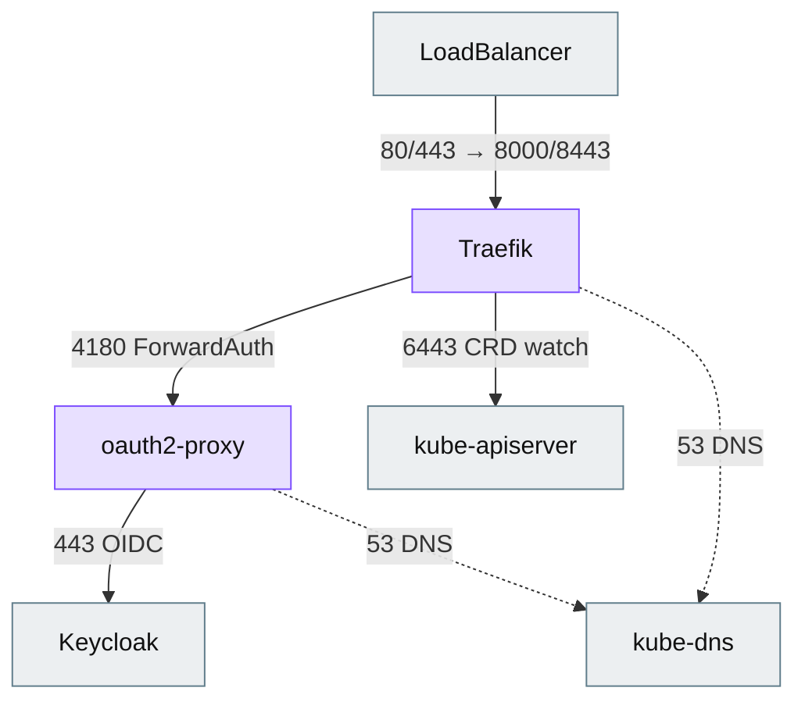

# NetworkPolicies, CNI and CSI

This document explains how the CNI (network) and CSI (storage) choices relate to
this deployment, and how to use the optional `networkPolicy.enabled` flag.

## TL;DR

- **CSI / storage: not applicable.** The workload is stateless — no PVCs, no
  `StorageClass`. The CSI driver is irrelevant.
- **CNI: the workload is agnostic, except NetworkPolicy.** On a default-deny
  cluster you must allow a few flows; `networkPolicy.enabled=true` renders them.
- **Cilium as the load balancer** is a *different* axis —
  `loadBalancer.backend=cilium` (see the main README §4).

## Why CSI does not matter here

Both workloads are stateless:

- **Traefik** runs with `readOnlyRootFilesystem: true` and an `emptyDir` at
  `/data`. TLS is served from a pre-created Secret (`dashboard.tlsSecretName`),
  so there is **no ACME / `acme.json`** to persist.
- **oauth2-proxy** keeps sessions in the client cookie (`static://202` upstream),
  so there is no server-side session store.

No `PersistentVolumeClaim`, no `StorageClass`, no volume snapshot — the CSI
driver plays no role. Storage only becomes relevant if you **self-host Keycloak
or Vault** in the same cluster; those are external dependencies and out of scope
for this chart.

## Why CNI mostly does not matter — and the one place it does

Traefik and oauth2-proxy are ordinary pods with a `Service` (LoadBalancer) and a
`ClusterIP`. They run unchanged on Calico, Cilium, OVN-Kubernetes, Antrea,
flannel, etc. MTU, overlay/underlay and IPAM are transparent to the app.

The **one** interaction is **NetworkPolicy**. If the namespace is *default-deny*
(a baseline in many secure / air-gapped environments), these required flows are
blocked unless explicitly allowed:

| Flow | Port | Why |
|---|---|---|
| LoadBalancer → Traefik | 8000 / 8443 (80/443) | Serve the dashboard |
| Traefik → oauth2-proxy | 4180 | ForwardAuth (`/oauth2/auth`) |
| oauth2-proxy → Keycloak | 443 | OIDC exchange |
| Traefik → kube-apiserver | 6443 (or 443) | `kubernetesCRD` provider watch |
| Traefik / oauth2-proxy → kube-dns | 53 | DNS resolution |

<details>
<summary><b>Diagram — required network flows</b> (click to expand)</summary>



</details>

## The `networkPolicy.enabled` flag

Setting it renders two `NetworkPolicy` objects (see
[`templates/networkpolicy.yaml`](../helm/traefik-keycloak/templates/networkpolicy.yaml)):

- **traefik** — ingress on 8000/8443/8080; egress to DNS, oauth2-proxy:4180 and
  the API-server port.
- **oauth2-proxy** — ingress on 4180; egress to DNS and Keycloak:443.

```bash
helm upgrade --install traefik ./helm/traefik-keycloak -n traefik \
  -f sites/values-<platform>.yaml \
  --set networkPolicy.enabled=true \
  --set networkPolicy.apiServerPort=6443 \
  --set networkPolicy.keycloakEgressCIDR=10.0.0.0/8   # optional: tighten egress
```

### Tuning

| Value | Default | Notes |
|---|---|---|
| `networkPolicy.apiServerPort` | `6443` | Some managed distros expose the API server on `443`. |
| `networkPolicy.keycloakEgressCIDR` | `""` (all) | Restrict oauth2-proxy egress on 443 to your Keycloak/OIDC range. |

### Caveats

- These are a **working minimal baseline**, not a hardened policy set. Tighten the
  selectors and CIDRs to your environment.
- **Kubelet health probes** originate from the node; some CNIs subject them to
  policy and some do not. The ingress rules keep the probe ports (8080, 4180)
  open, which covers both cases.
- If Keycloak is **in-cluster**, replace the broad 443 egress with a
  `podSelector`/`namespaceSelector` to the Keycloak pods instead of a CIDR.
- NetworkPolicies are **additive**; other policies in the namespace still apply.

## Cilium specifics

- **Cilium as CNI**: standard `NetworkPolicy` objects work. Cilium also offers
  `CiliumNetworkPolicy` (L7-aware) — not required here.
- **Cilium as LoadBalancer**: use `loadBalancer.backend=cilium` and request an IP
  with the `lbipam.cilium.io/ips` annotation on the Traefik Service (set it under
  `traefik.service.annotations`). This is independent of `networkPolicy.enabled`.
